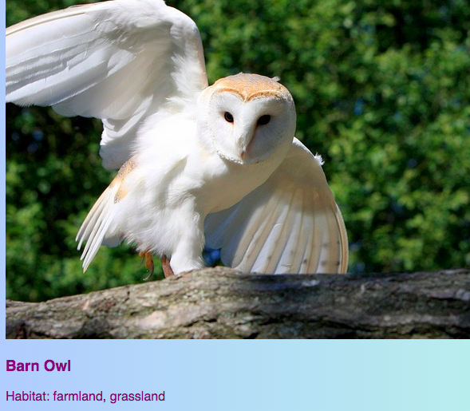

<h2 class="c-project-heading--task">Add a preview card</h2>

Add a preview card to your homepage so visitors can quickly spot one of your featured birds and click to learn more.

<h2 class="c-project-heading--explainer">Follow these instructions</h2>

## Step 1

Add the following HTML code to **index.html**.

--- code ---
---
language: html
filename: index.html
line_numbers: true
line_number_start: 31
line_highlights: 33-37 
---
      
      
      <article class="card">
        
        <h3>Barn Owl</h3>
        
Habitat: farmland, grassland

      </article>
      
    </main>
--- /code ---

## Step 2

Click **Run** and check that a new Barn Owl card appears on your homepage under the featured image.

## Now run your code

Click **Run** and check that a new Barn Owl card appears on your homepage under the featured image.
