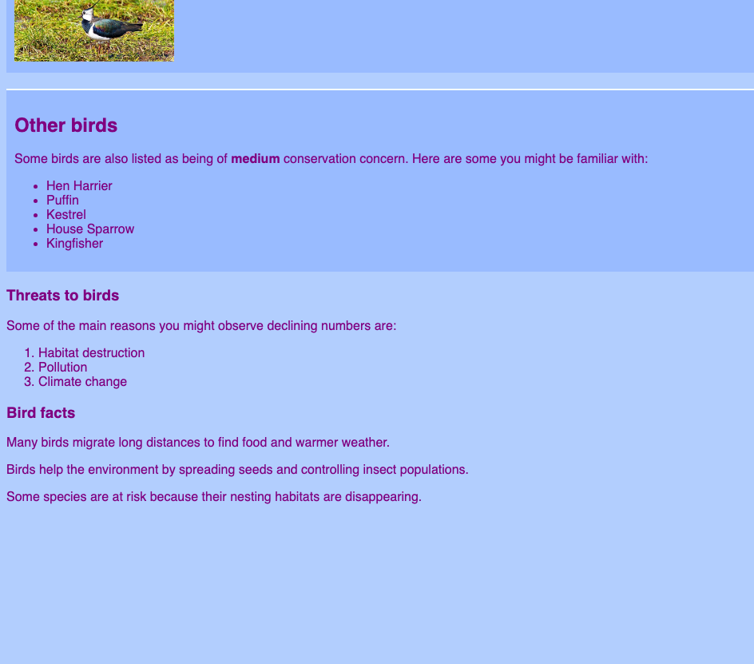

<h2 class="c-project-heading--task">Add side notes to the birds page</h2>

--- task ---

Add side notes to your **birds.html** page so you can include extra facts and useful links without crowding the main article.

--- /task ---

--- code ---
---
language: html
filename: birds.html
line_numbers: true
line_number_start: 80
line_highlights: 82-99
---
      </article>
      
      <aside>
        <h3>Threats to birds</h3>
        

          Some of the main reasons you might observe declining numbers are:
        

        <ol>
          <li>Habitat destruction</li>
          <li>Pollution</li>
          <li>Climate change</li>
        </ol>
      </aside>

      <aside>
        <h3>Bird facts</h3>
        
Many birds migrate long distances to find food and warmer weather.

        
Birds help the environment by spreading seeds and controlling insect populations.

        
Some species are at risk because their nesting habitats are disappearing.

      </aside>

    </main>
--- /code ---

--- task ---

Click **Run** and check that the extra notes appear outside the main bird list on the birds page.

--- /task ---

