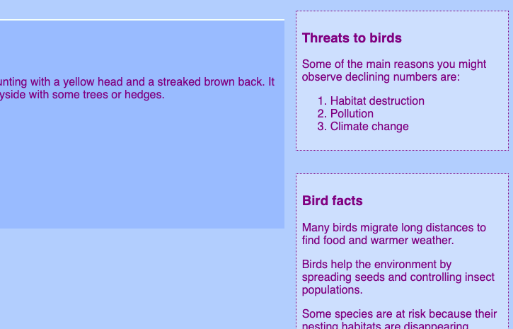

## Style the side notes

Style your side notes in **styles.css** so they stand out from the main article and make the extra information easier to spot.

```css filename="styles.css" line_numbers="true" line_number_start="181" line_highlights="185-197"
.myGridAside2 {
    grid-area: egAside2;
}

.sideNoteStyle {
  border: dotted 1px purple;
  background-color: #cddffe;
  padding: 0.5em;
  margin: 0.5em;
}
.warnOrange {
    background-color: #ffa500;
}
.warnRed {
    color: #FF4500;
    font-size: larger;
}
```

## Now run your code

Click **Run** and check that the side notes appear in styled boxes.




