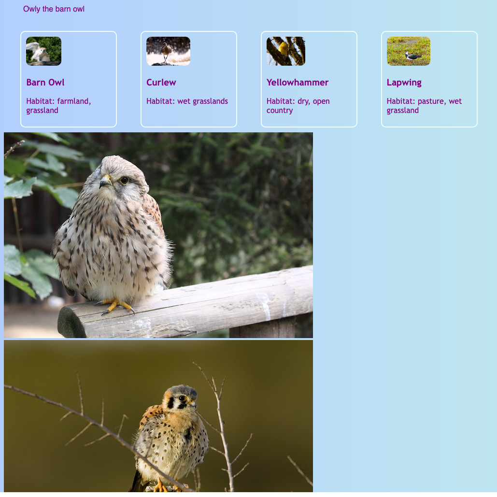

<h2 class="c-project-heading--task">Challenge: Create a photo collage</h2>

Build a photo collage on your homepage so the site feels richer and more eye-catching.

<h2 class="c-project-heading--explainer">Follow these instructions</h2>

## Step 1

### Tip

Exact positioning lets you place images wherever you want instead of leaving them in a simple row. That makes it ideal for building a collage.

--- code ---
---
language: html
filename: index.html
line_numbers: true
line_number_start: 68
line_highlights: 77-84
---
      <a href="birds.html" class="cardLink">
        <article class="card">
          
          <h3>Hen Harrier</h3>
          
Habitat: moorlands

        </article>
      </a>
    

    

      
      
      
      
      
      
<em>The Kestrel</em>

    

  </main>
--- /code ---

## Step 2

Click **Run** and check that the collage images and text appear on the homepage ready to be styled.

## Now run your code

Confirm the observable result.
