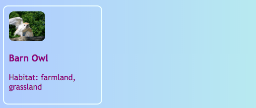

<h2 class="c-project-heading--task">Style the preview card</h2>

### Step 1

Style your preview card by making the image into a thumbnail and a clear card shape.

### Tip

A thumbnail is a small picture that shows a preview of something bigger.

### Step 2

Click on the project file tab and select **styles.css**

### Step 3

Add the highlighted CSS below to create a small card with a rounded picture. You can experiment with the border and colour setting to look how you want it.

--- code ---
---
language: css
filename: styles.css
line_numbers: true
line_number_start: 103
line_highlights: 107-130
---
.niceLinks:hover {
  color: #00FF7F;
}

.tinyPicture {
  height: 60px;
  border-radius: 10px;
}

.card {
  width: 200px;
  height: 200px;
  border: 2px solid #F0FFFF;
  border-radius: 10px;
  box-sizing: border-box;
  padding: 10px;
  margin-top: 10px;
  font-family: "Trebuchet MS", sans-serif;
}

.card:hover {
  border-color: #1E90FF;
}

.cardLink {
  color: inherit;
  text-decoration: none;
}

/**********************************
This section is for styling tables
--- /code ---

### Step 4

Click **Run** and check that the card now has a border, rounded corners, and a small rounded thumbnail image.

