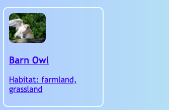

<h2 class="c-project-heading--task">Make your cards clickable</h2>

Turn your homepage cards into clickable links so people can use them to jump straight to the matching bird sections.

## Step 1

Go to the **index.html** file.

## Step 2

Add the code below to wrap your barn owl card in a link.

--- code ---
---
language: html
filename: index.html
line_numbers: true
line_number_start: 31
line_highlights: 33, 39
--- 
      

      <a href="birds.html" class="cardLink">
        <article class="card">
          
          <h3>Barn Owl</h3>
          
Habitat: farmland, grassland

        </article>
      </a>
      
    </main>
--- /code ---

## Now run your code

Click **Run** and check that the barn owl card is clickable and opens the barn owl section on `birds.html`.

