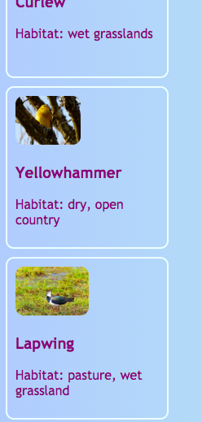

<h2 class="c-project-heading--task">Add more bird cards</h2>

--- task ---

Now that the Barn Owl card works, add more cards for the other birds on your site.

--- /task ---

--- task ---

Make cards for more birds from your project, such as:
- Curlew
- Yellowhammer
- Lapwing
- Hen Harrier

--- /task ---

--- task ---

When you have added all of your bird cards, wrap the whole set of card links in one `div` with the class `cardContainer`.

--- /task ---

--- task ---

In **index.html**, add more linked cards. For example, here is the Barn Owl card followed by one for Curlew:

--- /task ---

--- code ---
---
language: html
filename: index.html
line_numbers: true
line_number_start: 33
line_highlights: 33, 43-49
---
    

      <a href="birds.html" class="cardLink">
        <article class="card">
          
          <h3>Barn Owl</h3>
          
Habitat: farmland, grassland

        </article>
      </a>

      <a href="birds.html" class="cardLink">
        <article class="card">
          
          <h3>Curlew</h3>
          
Habitat: wet grasslands

        </article>
      </a>
    

--- /code ---

--- task ---

Click **Run** and check that you now have more than one card on the homepage, with each card linking to the matching bird section.

This section can be styled later.

--- /task ---

