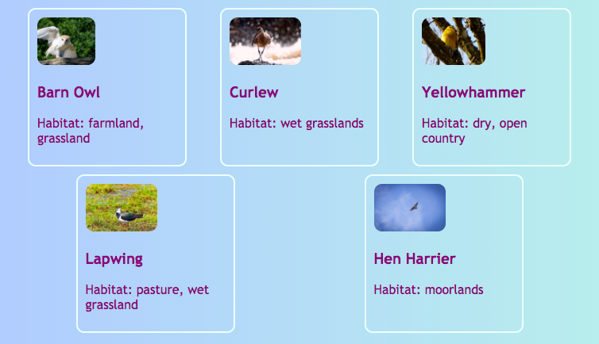

<h2 class="c-project-heading--task">Arrange the cards in a row</h2>

Use CSS to style the `cardContainer` so the cards sit side by side and wrap neatly when there is less space.

<h2 class="c-project-heading--explainer">Follow these instructions</h2>

## Step 1

In **styles.css**, add a flex rule for `.cardContainer`.

--- code ---
---
language: css
filename: styles.css
line_numbers: true
line_number_start: 131
line_highlights: 136-141
---
.cardLink {
  color: inherit;
  text-decoration: none;
}

.cardContainer {
    display: flex;
    flex-wrap: wrap;
    justify-content: space-around;
    padding: 10px;
}
--- /code ---

## Step 2

Click **Run** and check that the cards sit in a row when there is space and wrap onto a new line when the window gets narrower.

## Now run your code

Confirm the observable result.
