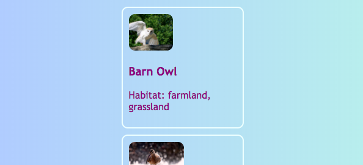

<h2 class="c-project-heading--task">Centre the cards</h2>

--- task ---

Move your cards into the centre of the page so they feel more polished and are ready for a larger card layout.

--- /task ---

--- task ---

In **styles.css**, add the highlighted lines to the `.card` rule.

--- /task ---

--- code ---
---
language: css
filename: styles.css
line_numbers: true
line_number_start: 114
line_highlights: 123-124
---
.card {
    width: 200px;
    height: 200px;
    border: 2px solid #F0FFFF;
    border-radius: 10px;
    box-sizing: border-box;
    padding: 10px;
    margin-top: 10px;
    font-family: "Trebuchet MS", sans-serif;
    margin-left: auto;
    margin-right: auto;
}
--- /code ---

--- task ---

Click **Run** and check that each card stays centred, even when you make the browser wider and narrower.

--- /task ---

