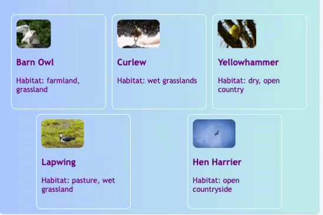

## Improve the card hover effect

Add a smoother hover effect so each card feels more lively when you move the pointer over it.

In **styles.css**, update the card styles with the highlighted lines below to add a transition, a shadow, and a slight lift.

```css filename="styles.css" line_numbers="true" line_number_start="127" line_highlights="129-130"
.card:hover {
    border-color: #1E90FF;
    box-shadow: 0px 4px 4px rgba(0,0,139,0.5);
    transform: translateY(-2px);
}

.cardLink {
```

## Now run your code

Click **Run** and check that the cards still sit in a row and lift when you hover over them.



> [!TIP]
>
> - `rgba` is a way to set a colour using red, green, blue, and alpha. `rgba(0,0,139,0.5)` means a dark blue with some see-through opacity.
> - `translateY` moves an element up or down.


