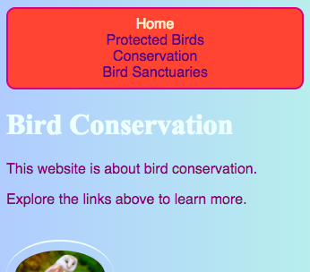

## Make the menu responsive

Make your navigation menu responsive in **styles.css** so it works neatly on small screens first and then spreads out on larger screens.

```css filename="styles.css" line_numbers="true" line_number_start="12" line_highlights="19-20,41-53"
nav ul {
  background-color: tomato;
  border-style: solid;
  border-color: MediumVioletRed;
  border-width: 2px;
  padding: 10px;
  border-radius: 10px;
  display: flex;
  flex-direction: column;
}

nav ul li {
  list-style-type: none;
  display: inline;
  margin-right: 10px;
  margin-left: 10px;
  color: PapayaWhip;
  text-align: center;
}

nav ul li a {
  text-decoration: none;
  color: indigo;
}

nav ul li a:hover {
  color: #ffefd5;
}

@media all and (min-width: 400px) {
  nav ul {
    flex-direction: row;
    justify-content: space-around;
  }
}

@media all and (min-width: 1600px) {
  nav ul {
    flex-direction: row;
    justify-content: flex-end;
  }
}

.darkerBackground {
  background-color: #99bbff;
}
```

## Now run your code

Click **Run**, make the browser narrow and wide, and check that the menu stacks on smaller screens before spreading into a row on larger screens.




> [!TIP]
>
> Remove `display: inline;` from `nav ul li` because flexbox now controls how the menu items are laid out.


